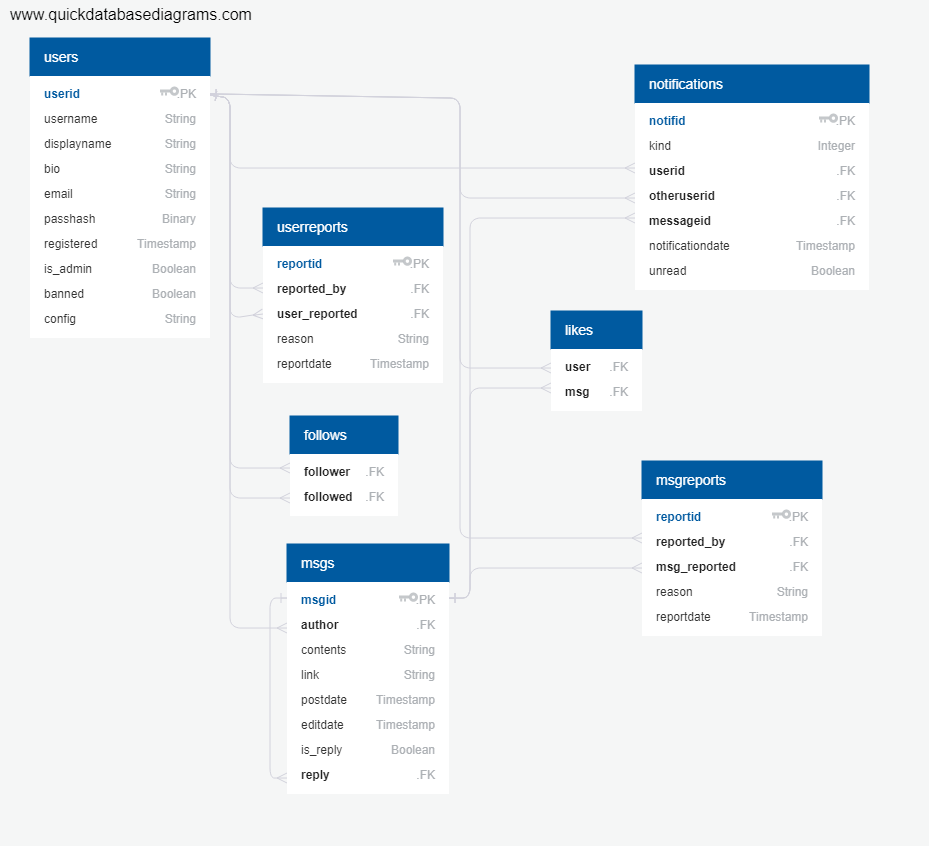

# Tietokannat

## Kaavio


# Normalisoinnin puute
Ainoa mahdollinen puute on se, että käyttäjätaulussa on useita asetuksia yhden
sarakkeen alla JSON-muodossa. Tämä helpottaa asetusten lisäämistä ilman että
tietokannan rakennetta tarvitsee muuttaa.

# Tietokannan CREATE-käskyt
```
CREATE TABLE users (
        userid SERIAL NOT NULL,
        username VARCHAR(32) NOT NULL,
        displayname VARCHAR(64) NOT NULL,
        bio TEXT,
        email VARCHAR(256) NOT NULL,
        passhash BYTEA NOT NULL,
        registered TIMESTAMP WITHOUT TIME ZONE NOT NULL,
        is_admin BOOLEAN,
        banned BOOLEAN,
        msgsareprivate BOOLEAN,
        config TEXT,
        PRIMARY KEY (userid)
);

CREATE TABLE follows (
        follower INTEGER,
        followed INTEGER,
        FOREIGN KEY(follower) REFERENCES users (userid) ON DELETE CASCADE,
        FOREIGN KEY(followed) REFERENCES users (userid) ON DELETE CASCADE
);

CREATE TABLE msgs (
        msgid SERIAL NOT NULL,
        author INTEGER,
        contents VARCHAR(256) NOT NULL,
        link VARCHAR(256),
        postdate TIMESTAMP WITHOUT TIME ZONE NOT NULL,
        editdate TIMESTAMP WITHOUT TIME ZONE,
        is_reply BOOLEAN,
        reply INTEGER,
        PRIMARY KEY (msgid),
        FOREIGN KEY(author) REFERENCES users (userid) ON DELETE CASCADE,
        FOREIGN KEY(reply) REFERENCES msgs (msgid) ON DELETE SET NULL
);

CREATE TABLE userreports (
        reportid SERIAL NOT NULL,
        reported_by INTEGER,
        user_reported INTEGER NOT NULL,
        reason VARCHAR(128) NOT NULL,
        reportdate TIMESTAMP WITHOUT TIME ZONE NOT NULL,
        PRIMARY KEY (reportid),
        FOREIGN KEY(reported_by) REFERENCES users (userid) ON DELETE CASCADE,
        FOREIGN KEY(user_reported) REFERENCES users (userid) ON DELETE CASCADE
);

CREATE TABLE likes (
        "user" INTEGER,
        msg INTEGER,
        FOREIGN KEY("user") REFERENCES users (userid) ON DELETE CASCADE,
        FOREIGN KEY(msg) REFERENCES msgs (msgid) ON DELETE CASCADE
);

CREATE TABLE msgtag (
        msg INTEGER,
        tag INTEGER,
        FOREIGN KEY(msg) REFERENCES msgs (msgid) ON DELETE CASCADE,
        FOREIGN KEY(tag) REFERENCES tags (tagid) ON DELETE CASCADE
);

CREATE TABLE msgreports (
        reportid SERIAL NOT NULL,
        reported_by INTEGER,
        msg_reported INTEGER NOT NULL,
        reason VARCHAR(128) NOT NULL,
        reportdate TIMESTAMP WITHOUT TIME ZONE NOT NULL,
        PRIMARY KEY (reportid),
        FOREIGN KEY(reported_by) REFERENCES users (userid) ON DELETE CASCADE,
        FOREIGN KEY(msg_reported) REFERENCES msgs (msgid) ON DELETE CASCADE
);

CREATE TABLE notifications (
        notifid INTEGER NOT NULL,
        kind INTEGER NOT NULL,
        userid INTEGER NOT NULL,
        otheruserid INTEGER,
        messageid INTEGER,
        notificationdate TIMESTAMP WITHOUT TIME ZONE NOT NULL,
        unread BOOLEAN NOT NULL,
        PRIMARY KEY (notifid, kind),
        FOREIGN KEY(userid) REFERENCES users (userid) ON DELETE CASCADE,
        FOREIGN KEY(otheruserid) REFERENCES users (userid) ON DELETE CASCADE,
        FOREIGN KEY(messageid) REFERENCES msgs (msgid) ON DELETE CASCADE
);

CREATE INDEX idx_user_from_id ON users (userid);
CREATE INDEX idx_followeds_from_user ON follows (follower);
CREATE INDEX idx_msgs_from_user ON msgs (author);
CREATE INDEX idx_likes_from_msg ON likes (msg);
CREATE INDEX idx_notifs_from_user ON notifications (userid);

```
